<!--
  ══════════════════════════════════════════════════════════════
  assets/  →  header · whoami · languages · portfolio · email · linkedin · x · instagram  (.svg)
  ══════════════════════════════════════════════════════════════
-->

  

  
  &nbsp;
  
  &nbsp;
  
  &nbsp;
  
  &nbsp;
  

 

  
  

  <code>enesakan.com</code> &nbsp;·&nbsp; <code>info@enesakan.com</code> &nbsp;·&nbsp; <code>Turkey</code>

  

