<!--
  ══════════════════════════════════════════════════════════════
  assets/  →  header.svg · portfolio.svg · email.svg · linkedin.svg · x.svg · instagram.svg
  ══════════════════════════════════════════════════════════════
-->

  

  
  &nbsp;
  
  &nbsp;
  
  &nbsp;
  
  &nbsp;
  

 

### `~/whoami`

`01` &nbsp;&nbsp;Engineering resilient backends and interfaces people actually enjoy using.

`02` &nbsp;&nbsp;Building autonomous platforms and production-grade SaaS — zero to scale.

`03` &nbsp;&nbsp;Obsessed with clean architecture, performance budgets and pixel-level detail.

`04` &nbsp;&nbsp;Turning ambiguous ideas into shipped products, and products into systems.

`05` &nbsp;&nbsp;Sad but true — **_Valar Morghulis_**

 

  <code>enesakan.com</code> &nbsp;·&nbsp; <code>info@enesakan.com</code> &nbsp;·&nbsp; <code>Turkey</code>

  

