<!--
  ══════════════════════════════════════════════════════════════════════════
  © 2026 Enes Akan · enesakan.com
  Original design. Licensed under CC BY-NC-ND 4.0 — see LICENSE.
  Attribution required · No commercial use · No derivatives.
  Every file in assets/ carries embedded copyright metadata + a unique
  fingerprint (EA-…). Source of truth: github.com/eneesakan/eneesakan
  ══════════════════════════════════════════════════════════════════════════
-->

<!--
  ══════════════════════════════════════════════════════════════
  assets/  →  header · whoami · languages · footer · portfolio · email · linkedin · x · instagram  (.svg)
  ══════════════════════════════════════════════════════════════
-->

  

  
  &nbsp;
  
  &nbsp;
  
  &nbsp;
  
  &nbsp;
  

 

  
  

  

  

  <a href="./LICENSE">© 2026 Enes Akan · CC BY-NC-ND 4.0</a>

