<!--
  ─────────────────────────────────────────────────────────────
  Header is a custom animated SVG → commit it to  assets/header.svg
  ─────────────────────────────────────────────────────────────
-->

  

  
  &nbsp;
  
  &nbsp;
  
  &nbsp;
  

 

<table>
<tr>
<td valign="top" width="57%">

<h3><code>~/whoami</code></h3>

`01` &nbsp; Engineering resilient backends and interfaces people actually enjoy using.

`02` &nbsp; Building autonomous platforms and production-grade SaaS — zero to scale.

`03` &nbsp; Obsessed with clean architecture, performance budgets and pixel-level detail.

`04` &nbsp; Turning ambiguous ideas into shipped products, and products into systems.

`05` &nbsp; Sad but true — **_Valar Morghulis_**

 

`enesakan.com` &nbsp;·&nbsp; `info@enesakan.com` &nbsp;·&nbsp; Turkey

</td>
<td valign="top" width="43%">

</td>
</tr>
</table>

  

